# INSTAL·LACIÓ WINDOWS SERVER 2025

| Procediment |
|----------------------------------------|

- Crea una màquina virtual amb 8 GB de RAM i dos processadors. La VM disposarà de dos discos, un de 32 GB com a disc principal (on instal·lareu el SO) i un de secundari de 10 GB. La màquina haurà de tenir dues interfícies de xarxa: una en xarxa NAT (no NAT) i la segona en host-only.

Comencem creant la màquina, posant, nom, la ISO, Folder i posem l’opció del Skip Unattended Installation (Omet la instal·lació desatès).

Després de RAM posem 8 GB (8192 MB) i dos processadors.

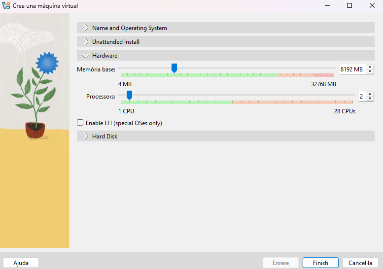

La VM disposarà de dos discos, un de 32 GB com a disc principal (on instal·larem el SO) i un de secundari de 10 GB. 

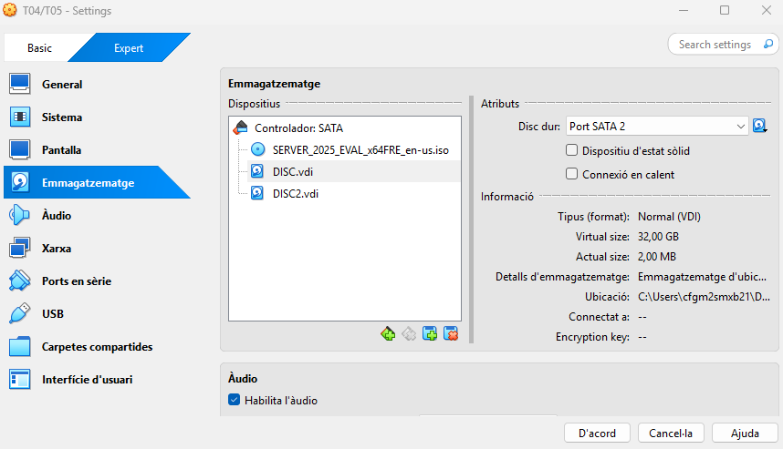

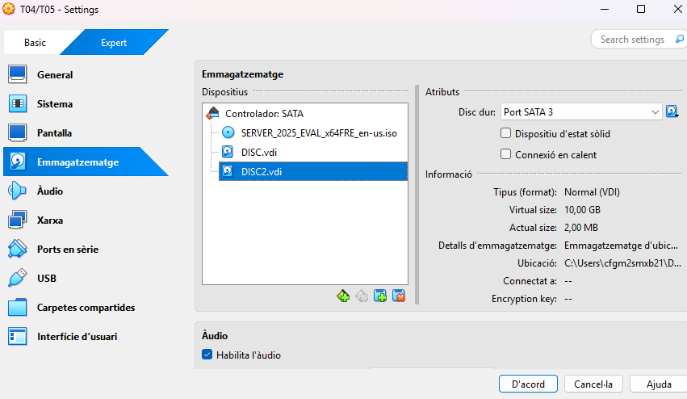

La màquina tindrà dues interfícies de xarxa: una en xarxa NAT (no NAT) i la segona en host-only.

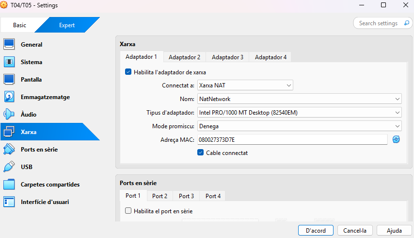

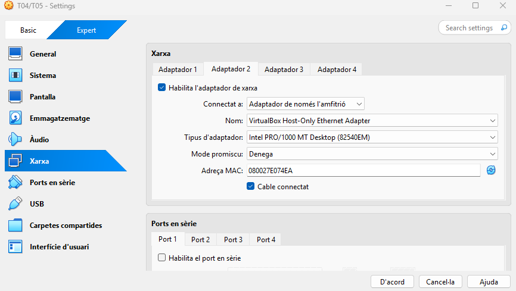

- Instal·la Windows Server 2025 en mode GUI, idioma US però configuració i teclat en espanyol.

Comencem la instal·lació, posarem d’idioma l’anglès (ja que és com es solen configurar els servers) i el teclat i configuracions regionals en espanyol. 

El teclat i mètode d'entrada en espanyol.

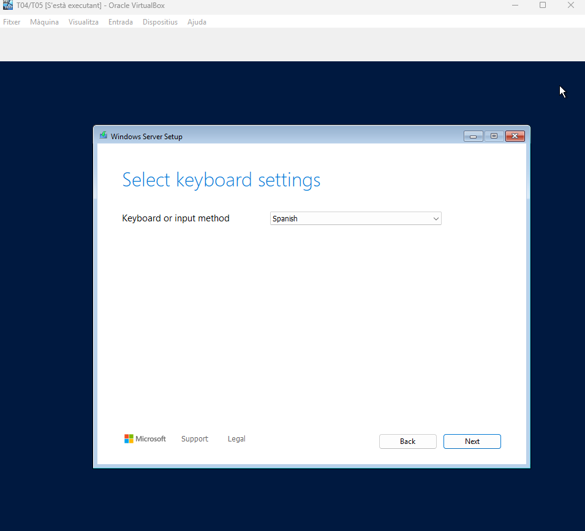

Instal·lem Windows Server.

Instal·lem Windows Server 2025 en mode GUI.

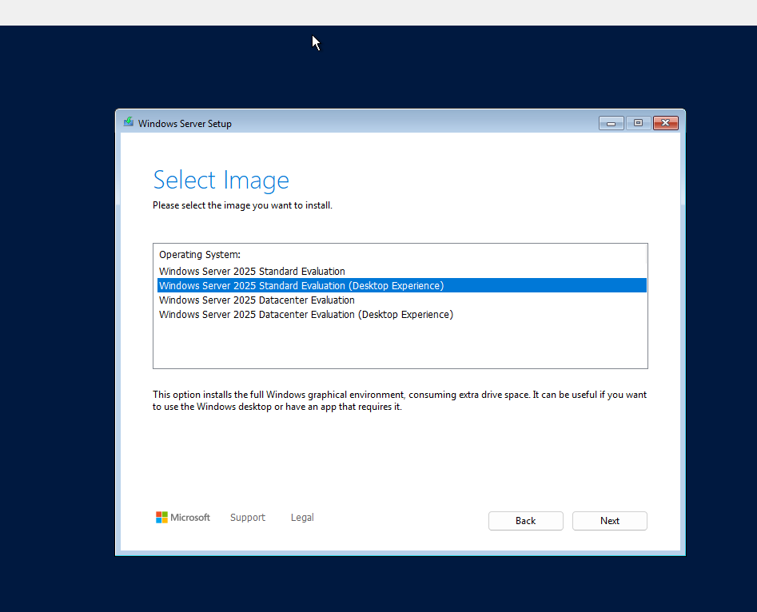

Acceptem els termes (EULA).

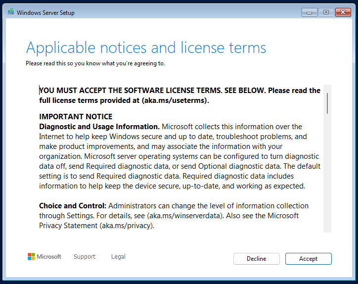

Escollim el disc principal.

Instal·lem.

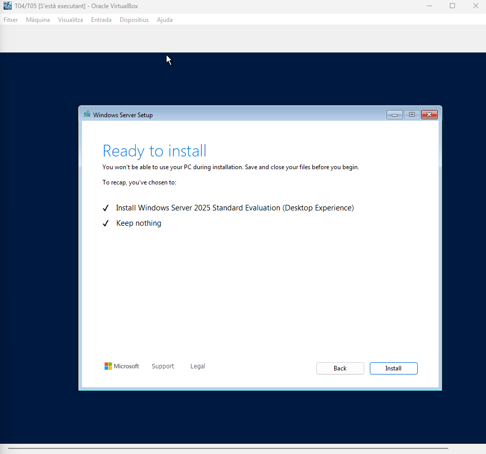

Configurem el compte d’Administrator, el qual l’user name (nom d'usuari) és Administrador i de contrasenya posem: P@ssw0rd.

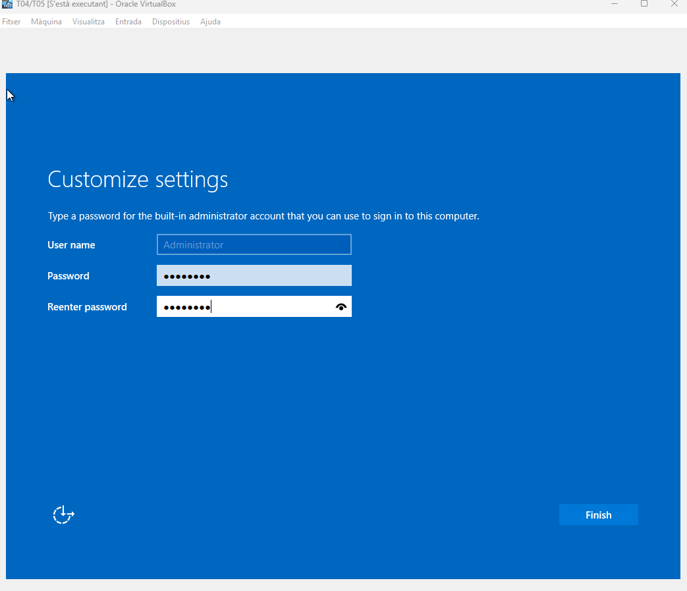

- Canvia el nom de l’equip a DCxx (xx és el vostre número de llista).

Canviem el nom de l’equip a DCxx (DC21), per això desde Server Manager anem a Computer name (nom de l'ordinador), Change (canviar) i posem el nou nom.

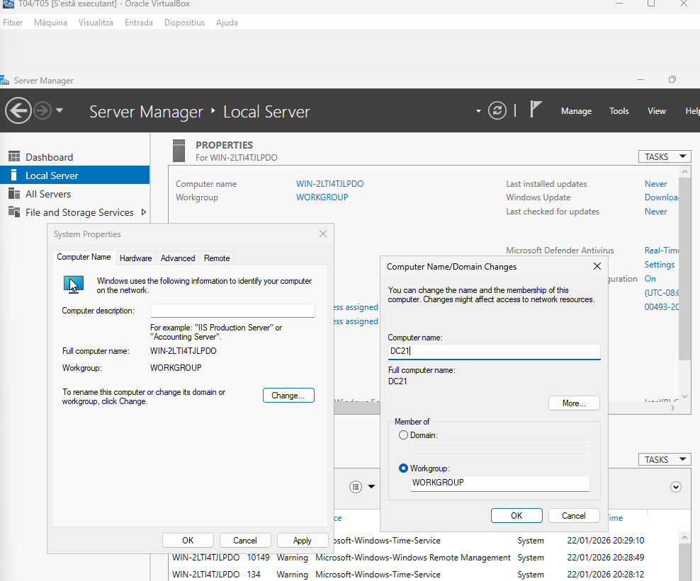

Reiniciem.

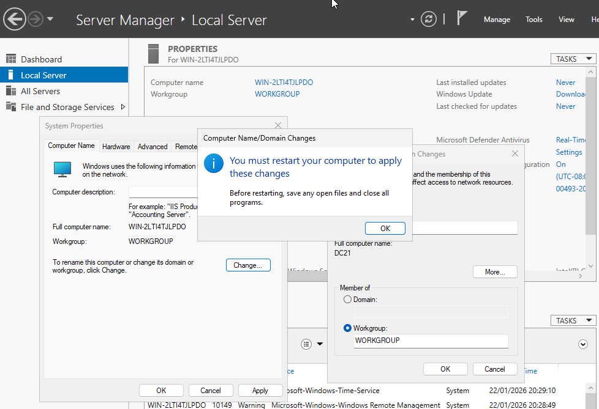

I veiem com s’ha canviat el nom.

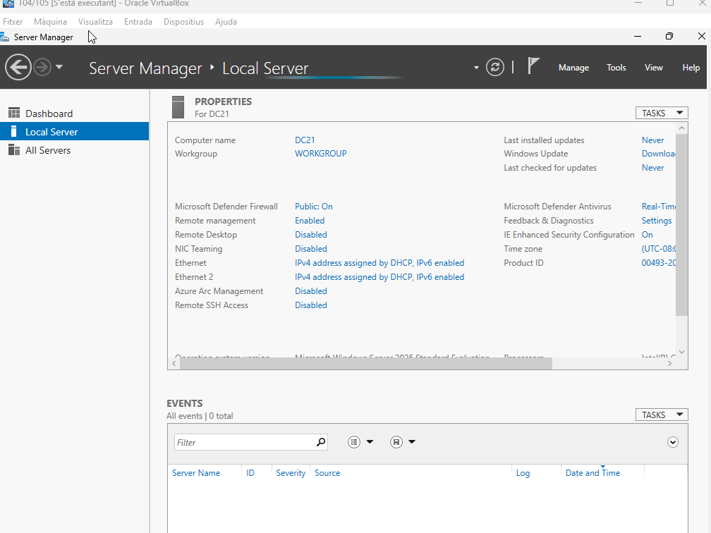

- Actualitza la màquina virtual (un cop fet, pausa les actualitzacions tot el temps que sigui possible).

Ara anem a configuració, Windows Update i fem les actualitzacions.

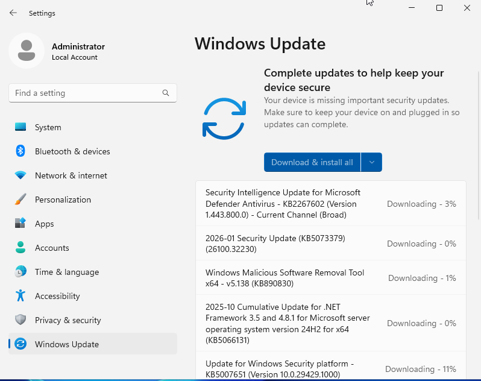

Actualitzacions fetes.

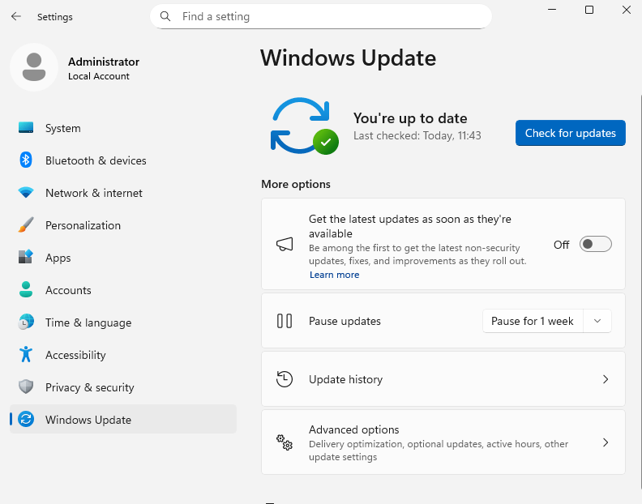

Pausem les actualitzacions tot el temps que sigui possible (5 setmanes).

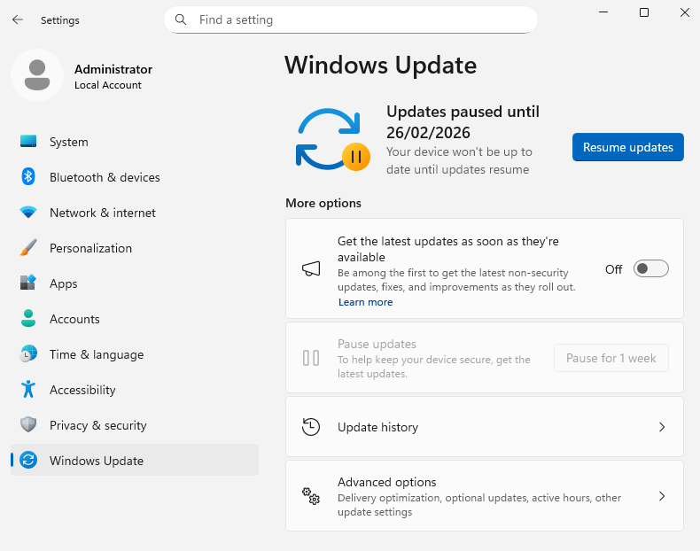

| Contingut de la guia |
|----------------------------------------|

**Compara la configuració de la màquina virtual definits a l’apartat anterior amb els requisits indicats per Microsoft. Són coherents?**

La configuració de la màquina virtual utilitzada és coherent amb els requisits oficials de Microsoft per a Windows Server 2025. El servidor virtual té 2 processadors, tot i que Microsoft només en demana 1, i té 8 GB de memòria RAM, que és molt més del mínim necessari perquè Windows Server amb pantalla gràfica funcioni bé.                 L’emmagatzematge, el disc principal de 32 GB compleix exactament el mínim requerit pel sistema operatiu, i el disc secundari de 10 GB aporta espai addicional (útil per a rols o dades). Finalment, les dues interfícies de xarxa configurades (NAT i Host‑Only) també s’ajusten als requisits, ja que Microsoft només demana un adaptador compatible.

**Documenta els diversos procediments de la instal·lació amb captures de pantalla i observacions. Recorda que el format a utilitzar és MarkDown.**

[Anar a l'enunciat](../Tasca04/README.md)  
[Anar a la pàgina inicial](../README.md)
