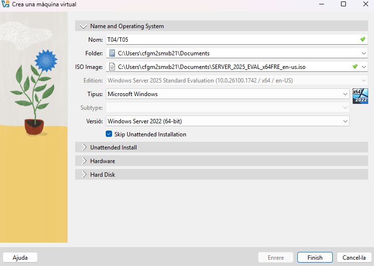

# INSTAL·LACIÓ DOMAIN CONTROLLER EN SERVER 2025/DESPLEGAMENT DE L’ACTIVE DIRECTORY

| T04 |
|----------------------------------------|

**Procediment**

- Crea una màquina virtual amb 8 GB de RAM i dos processadors. La VM disposarà de dos discos, un de 32 GB com a disc principal (on instal·lareu el SO) i un de secundari de 10 GB. La màquina haurà de tenir dues interfícies de xarxa: una en xarxa NAT (no NAT) i la segona en host-only.

Comencem creant la màquina, posant, nom, la ISO, Folder i posem l’opció del Skip Unattended Installation (Omet la instal·lació desatès).

