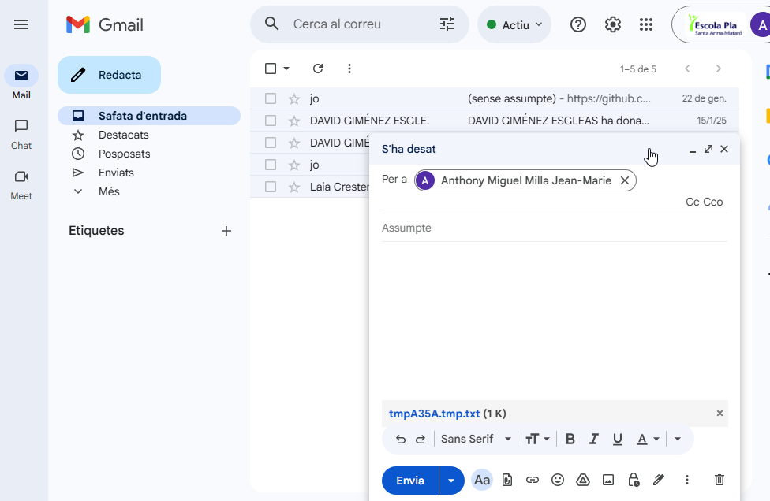
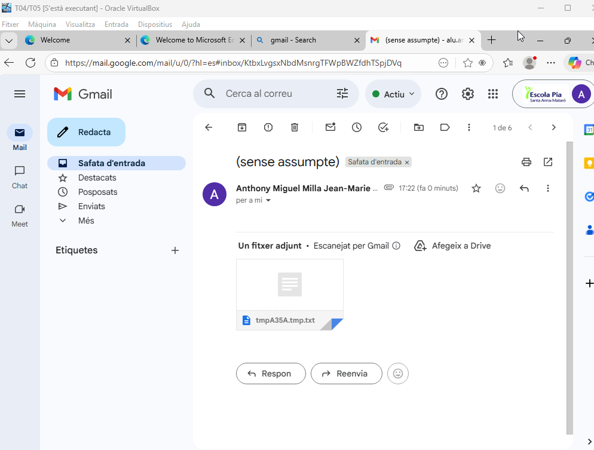

# INSTAL·LACIÓ DEL DOMINI

| Procediment a documentar |
|----------------------------------------|

- Instal·lar els rols necessaris al servidor.

Primerament anem a configuració, Network & internet (Xarxa i Internet), després a Ethernet i Edit (editar) en DNS server assignment (Assignació del servidor DNS).

[Anar a l'enunciat](../Tasca05/README.md)  
[Anar a la pàgina inicial](../README.md)
