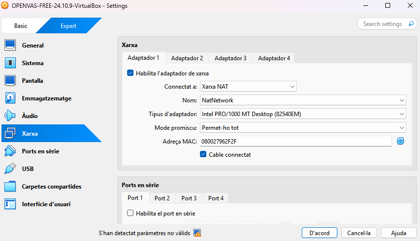
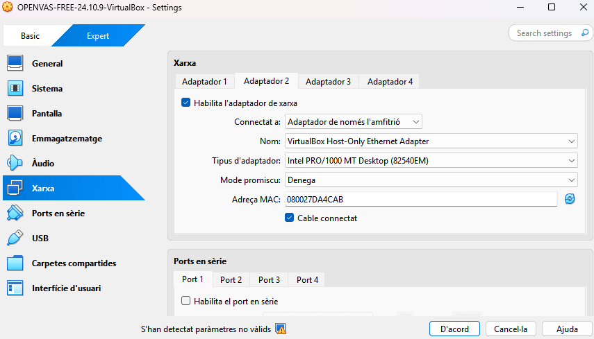

# Anàlisi vulnerabilitats

| Preparació de l'entorn |
|----------------------------------------|

| Equip a escannejar |
|----------------------------------------|

1. Descarregeu la .OVA corresponent a metasplotible-linux al vostre equip.
2. Importeu la màquina virtual a VirtualBox, assegureu-vos que la ruta on importarà la màquina és la que voleu utilitzar.
3. Configureu la màquina per tal que utilitzi xarxa en mode "xarxa-NAT".


4. Inicieu la màquina, les credencials per defecte són:
- Usuari:
```
msfadmin
```
- Contrasenya:
```
msfadmin
```
5. Un cop iniciada la màquina, obriu una terminal i executeu la comanda ip a per obtenir la IP assignada a la màquina. Anoteu aquesta IP, ja que la necessitareu més endavant.


| Equip amb OpenVAS |
|----------------------------------------|

1. Descarregeu la .OVA corresponent a OpenVAS al vostre equip.

2. Importeu la màquina virtual a VirtualBox, assegureu-vos de nou, que la ruta on importarà la màquina és la que voleu utilitzar.

3. Configureu la màquina per tal que utilitzi dues interfícies de xarxa, la primera en mode "xarxa-NAT" per tal tenir connectivitat a Internet i amb la màquina objectiu, i la segona en mode "host-only" per tal de poder accedir a la interfície web des del vostre equip.

4. Inicieu la màquina, les credencials per defecte són:

Usuari: 

admin

Contrasenya: admin

Un cop iniciada la màquina, s'obrirà un menú d'inicialització. En aquest menú, per exemple, us demanen la llicència, que podeu obviar 'Skip'. El que sí que caldrà fer són dues accions importants:

Definir l'usuari que usarem per entrar via web, per comoditat triarem un usuari admin amb contrasenya admin.

Configurar la xarxa de les dues interfícies, aquí cal seleccionar en cadascuna d'elles l'opció dhcp de IPv4. Finalment, anoteu les dues adreces.







[Anar a l'enunciat](../Tasca09/README.md)  
[Anar a la pàgina inicial](../README.md)
