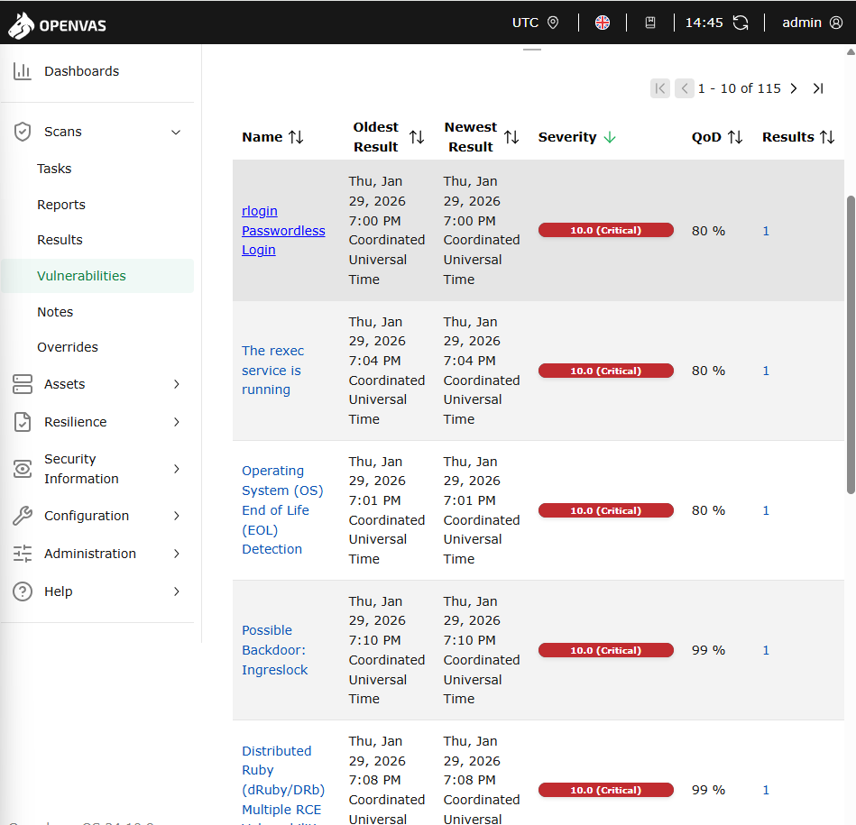
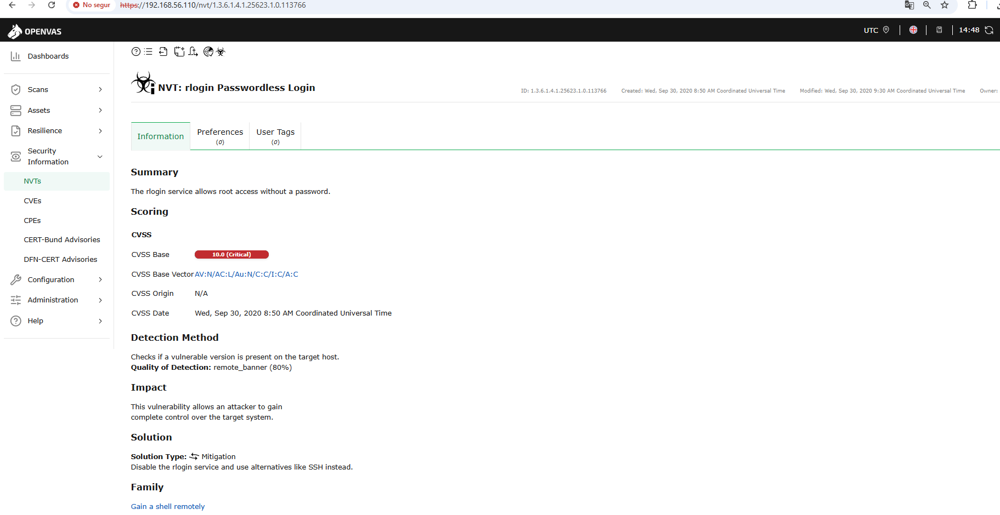
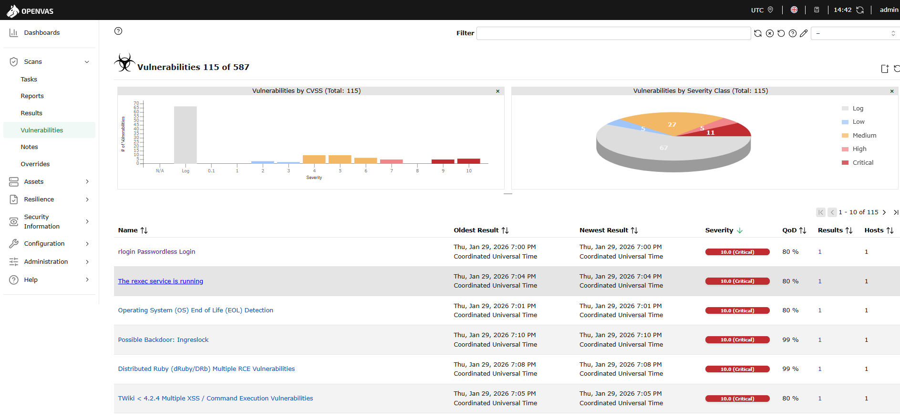
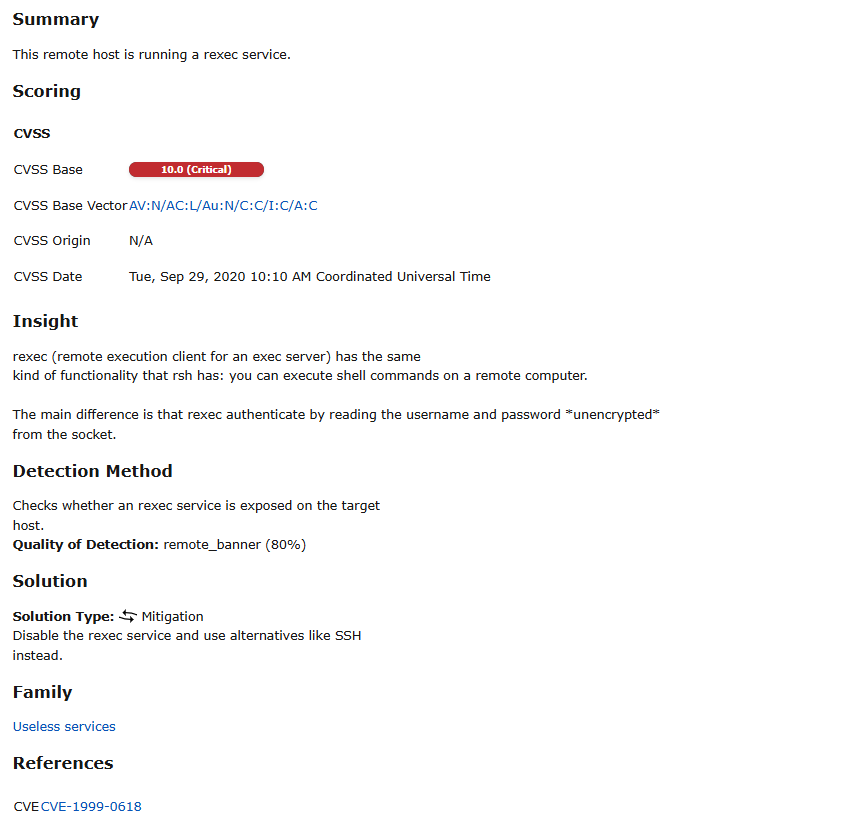
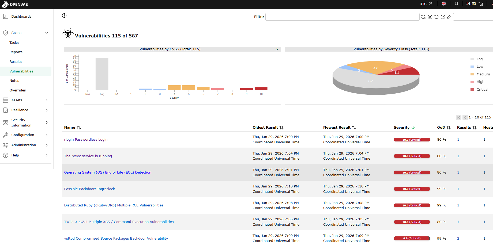
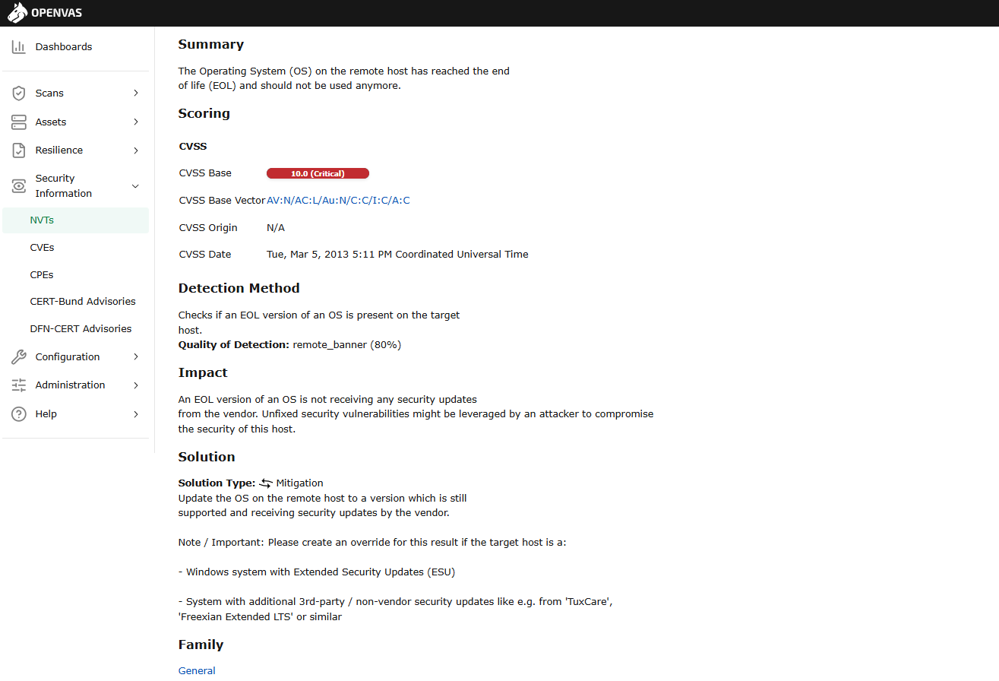
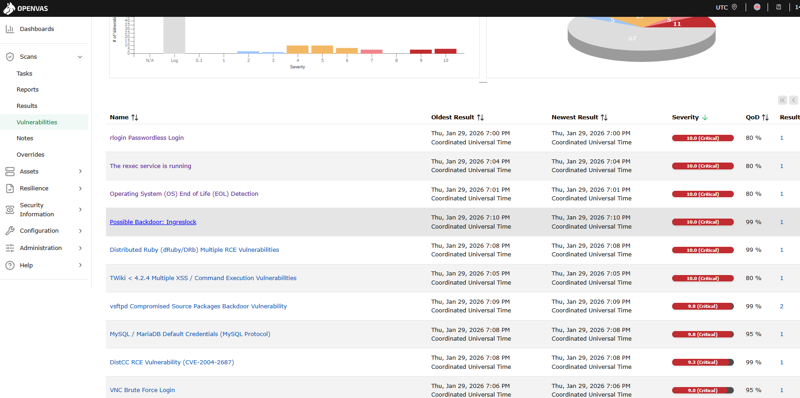
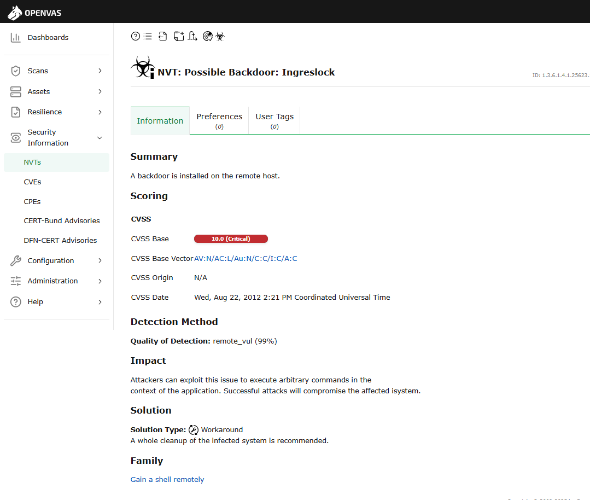

# Anàlisi vulnerabilitats

| Preparació de l'entorn |
|----------------------------------------|

| Equip a escannejar |
|----------------------------------------|

1. Descarregeu la .OVA corresponent a metasplotible-linux al vostre equip.
2. Importeu la màquina virtual a VirtualBox, assegureu-vos que la ruta on importarà la màquina és la que voleu utilitzar.
3. Configureu la màquina per tal que utilitzi xarxa en mode "xarxa-NAT".


4. Inicieu la màquina, les credencials per defecte són:
- Usuari:
```
msfadmin
```
- Contrasenya:
```
msfadmin
```
5. Un cop iniciada la màquina, obriu una terminal i executeu la comanda ```ip a``` per obtenir la IP assignada a la màquina. Anoteu aquesta IP, ja que la necessitareu més endavant.


| Equip amb OpenVAS |
|----------------------------------------|

1. Descarregeu la .OVA corresponent a OpenVAS al vostre equip.

2. Importeu la màquina virtual a VirtualBox, assegureu-vos de nou, que la ruta on importarà la màquina és la que voleu utilitzar.

3. Configureu la màquina per tal que utilitzi dues interfícies de xarxa, la primera en mode "xarxa-NAT" per tal tenir connectivitat a Internet i amb la màquina objectiu, i la segona en mode "host-only" per tal de poder accedir a la interfície web des del vostre equip.


4. Inicieu la màquina, les credencials per defecte són:

Usuari: 
```
admin
```
Contrasenya: 
```
admin
```

5. Un cop iniciada la màquina, s'obrirà un menú d'inicialització. En aquest menú, per exemple, us demanen la llicència, que podeu obviar 'Skip'. El que sí que caldrà fer són dues accions importants:

- Definir l'usuari que usarem per entrar via web, per comoditat triarem un usuari ```admin``` amb contrasenya ```admin```.

- Configurar la xarxa de les dues interfícies, aquí cal seleccionar en cadascuna d'elles l'opció dhcp de IPv4. Finalment, anoteu les dues adreces.


| Procediment pràctic |
|----------------------------------------|

| Anàlisi de vulnerabilitats |
|----------------------------------------|

1. Mostra l’accés a OpenVAS via web amb les credencials creades anteriorment. Veuràs que et surt un avís relatiu a la seguretat del certificat, ja que és un certificat autofirmat. Pots ignorar aquest avís.

Accés a OpenVAS via web amb les credencials creades anteriorment.


2. Afegeix la IP de la màquina vulnerable com a Host.

Anem a Assets, Hosts, afegir:


3. Configura un Target amb el Host del punt anterior, inclou les credencials de la màquina vulnerable per accedir via SSH i SMB.

En Actions, afegir:


Configurem un Target amb el Host del punt anterior, incloem les credencials de la màquina vulnerable per accedir via SSH i SMB.


Afegir:


Resultat:


4. Realitza una exploració de vulnerabilitats. Aquest procés pot ser lent, si veieu que us queda poc temps, cancel·leu l’anàlisi i treballeu amb els resultats obtinguts.

Anem a Tasks i New Task.


Afegim:


Resultat:


Fem l'anàlisi (Play).


*Aquest procés pot ser lent, si veieu que us queda poc temps, cancel·leu l’anàlisi i treballeu amb els resultats obtinguts.

El vaig deixar més d’1 hora i encara no havia acabat, estava al 94% i vaig treballar amb els resultats obtinguts.

| Recollida de resultats |
|----------------------------------------|

Un cop acabem l’exploració OpenVAS ens mostra els resultats corresponents a la màquina, podem veure la descripció de la vulnerabilitat i resta de informació significativa. 

Resultats:


| Documentació de l'activitat |
|----------------------------------------|

Documenta bé en un arxiu de Google Docs (assegura't de compartir-lo amb el teu professor) o directament en format Markdown, a la carpeta corresponent del repositori GitHub del projecte, els següents punts:

- Documentació del procés d'anàlisi de vulnerabilitats seguit:

-Configuració de la màquina vulnerable.

-Configuració de la màquina OpenVAS.

-Passos seguits per realitzar l'anàlisi.

- Analitza quatre vulnerabilitats trobades:

-Descripció de la vulnerabilitat incloent el seu CVE.

-Nivell de gravetat.

-Possible explotació.

-Mesures de mitigació proposades.

Anem a Scans, Vulnerabilities i entrem a 4 vulnerabilitats trobades.





- **Descripció de la vulnerabilitat incloent el seu CVE.**
- **Nivell de gravetat.**


- **Possible explotació.**
- **Mesures de mitigació proposades.**

**Mètode de detecció**

Comprova si hi ha una versió vulnerable a l'amfitrió de destinació.                     
Qualitat de la detecció: remote_banner (80%)

**Impacte**

Aquesta vulnerabilitat permet a un atacant obtenir                  
control complet sobre el sistema de destinació.

**Solució**

**Tipus de solució:** Mitigació          
Desactiveu el servei rlogin i utilitzeu alternatives com ara SSH.

-Següent vulnerabilitat. 





- **Descripció de la vulnerabilitat incloent el seu CVE.**
- **Nivell de gravetat.**


- **Possible explotació.**
- **Mesures de mitigació proposades.**

**Visió**

rexec (client d'execució remota per a un servidor executiu) té el mateix tipus de funcionalitat que rsh: podeu executar ordres de shell en un ordinador remot.

La principal diferència és que rexec s'autentica llegint el nom d'usuari i la contrasenya *sense xifrar* del sòcol.

**Mètode de detecció**

Comprova si un servei rexec està exposat a l'amfitrió de destinació.           
**Qualitat de la detecció:** remote_banner (80%)

**Solució**

**Tipus de solució:** Mitigació          
Desactiveu el servei rexec i utilitzeu alternatives com ara SSH en el seu lloc.

-Següent vulnerabilitat. 
  




- **Descripció de la vulnerabilitat incloent el seu CVE.**
- **Nivell de gravetat.**


- **Possible explotació.**
- **Mesures de mitigació proposades.**

**Mètode de Detecció**

Comprova si una versió EOL d'un SO està present en l'amfitrió objectiu.                
**Qualitat de Detecció:** remote_banner (80%)

**Impacte**

Una versió EOL d'un SO no està rebent actualitzacions de seguretat del venedor. Vulnerabilitats de seguretat sense corregir podrien ser aprofitades per un atacant per comprometre la seguretat d'aquest amfitrió.

**Solució**

**Tipus de Solució:** Mitigació      
Actualitza el SO en l'amfitrió remot a una versió que encara estigui suportada i rebent actualitzacions de seguretat pel venedor.

Nota / Important: Si us plau, crea una anul·lació per a aquest resultat si l'amfitrió objectiu és un:

- Sistema Windows amb Actualitzacions de Seguretat Esteses (ESU)

- Sistema amb actualitzacions de seguretat addicionals de tercers / no venedores, com per exemple actualitzacions com e.g. de 'TuxCare', 'Freexian Extended LTS' o similar.

-Següent vulnerabilitat. 





- **Descripció de la vulnerabilitat incloent el seu CVE.**
- **Nivell de gravetat.**


- **Possible explotació.**
- **Mesures de mitigació proposades.**

**Mètode de Detecció**

**Qualitat de Detecció:** remote_vul (99%)

**Impacte**

Els atacants poden explotar aquest problema per executar comandes arbitràries en el context de l'aplicació. Atacs reeixits comprometran el sistema afectat.

**Solució**

**Tipus de Solució:** Solució alternativa      
Es recomana una neteja completa del sistema infectat.

[Anar a l'enunciat](../Tasca09/README.md)  
[Anar a la pàgina inicial](../README.md)
