# Anàlisi vulnerabilitats

| Preparació de l'entorn |
|----------------------------------------|

| Equip a escannejar |
|----------------------------------------|

1. Descarregeu la .OVA corresponent a metasplotible-linux al vostre equip.
2. Importeu la màquina virtual a VirtualBox, assegureu-vos que la ruta on importarà la màquina és la que voleu utilitzar.
3. Configureu la màquina per tal que utilitzi xarxa en mode "xarxa-NAT".

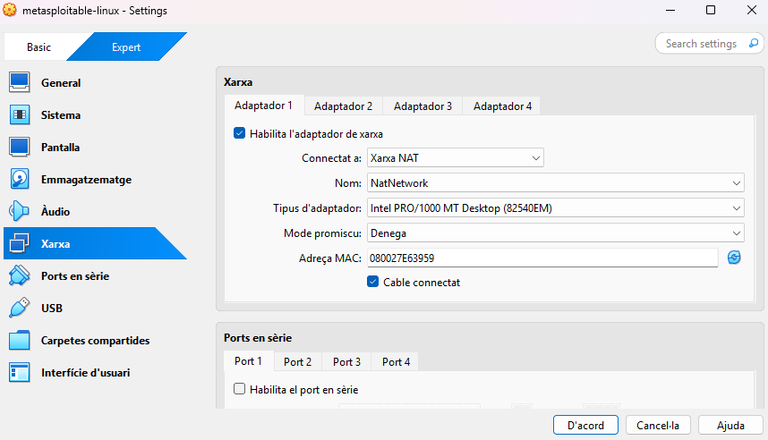

4. Inicieu la màquina, les credencials per defecte són:
- Usuari:
```
msfadmin
```
- Contrasenya:
```
msfadmin
```
5. Un cop iniciada la màquina, obriu una terminal i executeu la comanda ```ip a``` per obtenir la IP assignada a la màquina. Anoteu aquesta IP, ja que la necessitareu més endavant.

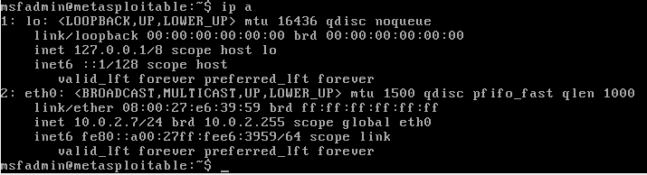

| Equip amb OpenVAS |
|----------------------------------------|

1. Descarregeu la .OVA corresponent a OpenVAS al vostre equip.

2. Importeu la màquina virtual a VirtualBox, assegureu-vos de nou, que la ruta on importarà la màquina és la que voleu utilitzar.

3. Configureu la màquina per tal que utilitzi dues interfícies de xarxa, la primera en mode "xarxa-NAT" per tal tenir connectivitat a Internet i amb la màquina objectiu, i la segona en mode "host-only" per tal de poder accedir a la interfície web des del vostre equip.


4. Inicieu la màquina, les credencials per defecte són:

Usuari: 
```
admin
```
Contrasenya: 
```
admin
```

5. Un cop iniciada la màquina, s'obrirà un menú d'inicialització. En aquest menú, per exemple, us demanen la llicència, que podeu obviar 'Skip'. El que sí que caldrà fer són dues accions importants:

- Definir l'usuari que usarem per entrar via web, per comoditat triarem un usuari ```admin``` amb contrasenya ```admin```.

- Configurar la xarxa de les dues interfícies, aquí cal seleccionar en cadascuna d'elles l'opció dhcp de IPv4. Finalment, anoteu les dues adreces.


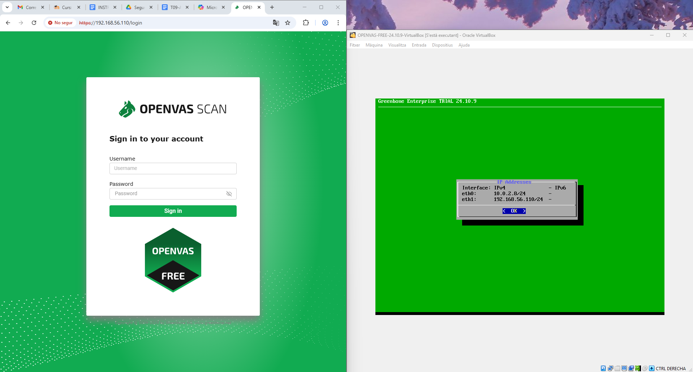

| Procediment pràctic |
|----------------------------------------|

| Anàlisi de vulnerabilitats |
|----------------------------------------|

1. Mostra l’accés a OpenVAS via web amb les credencials creades anteriorment. Veuràs que et surt un avís relatiu a la seguretat del certificat, ja que és un certificat autofirmat. Pots ignorar aquest avís.


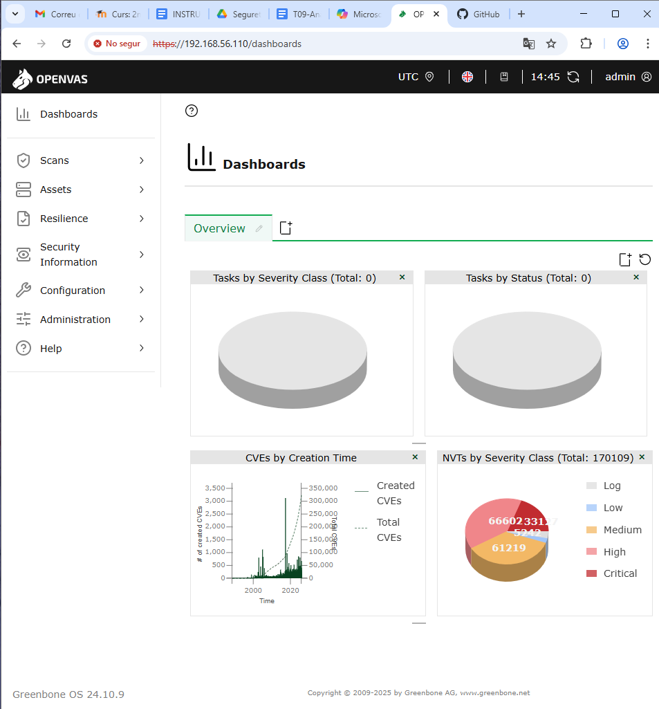

2. Afegeix la IP de la màquina vulnerable com a Host.


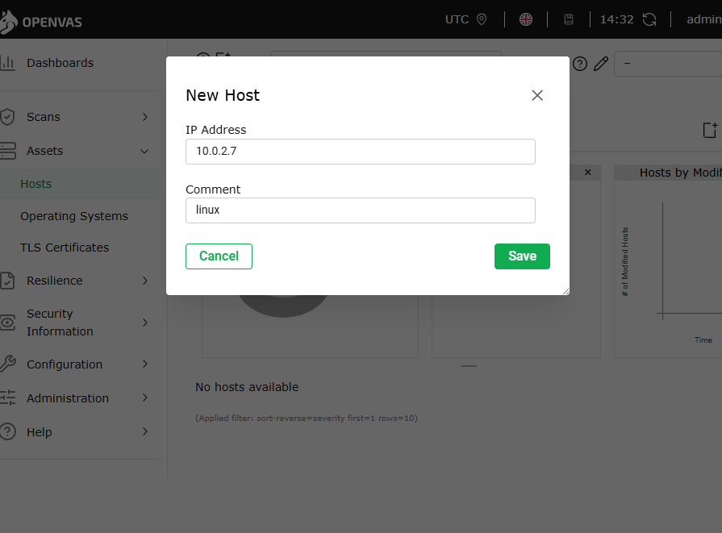

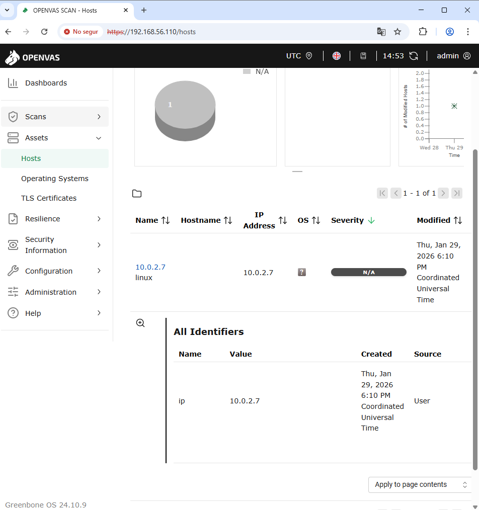

3. Configura un Target amb el Host del punt anterior, inclou les credencials de la màquina vulnerable per accedir via SSH i SMB.


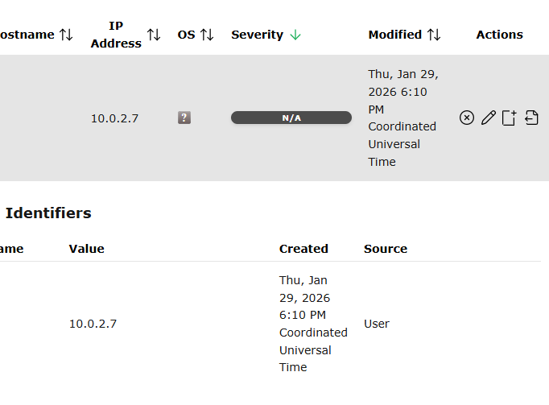

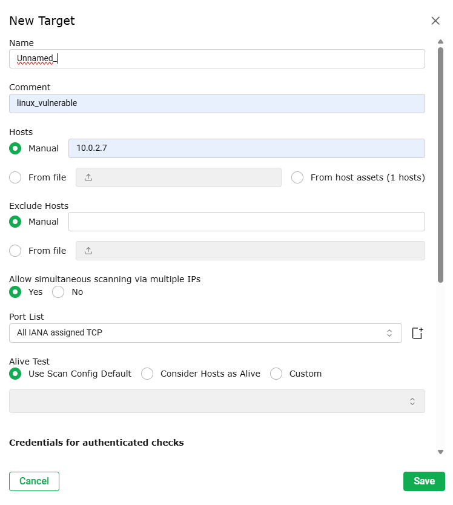

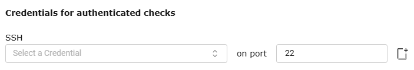

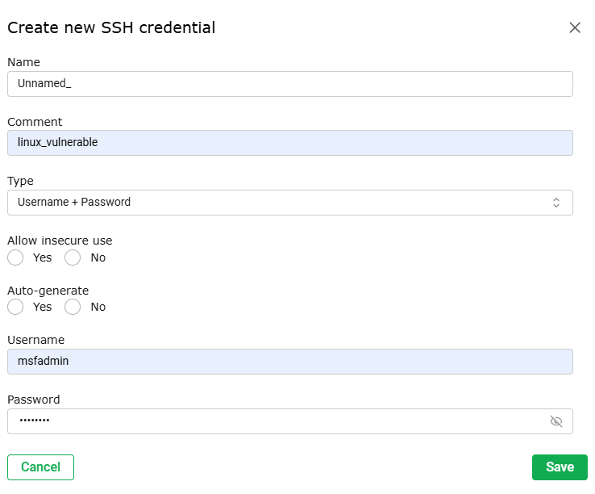

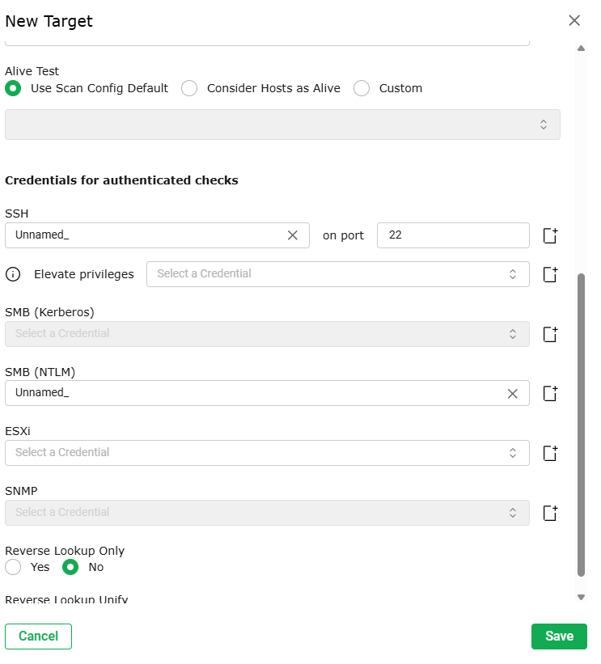

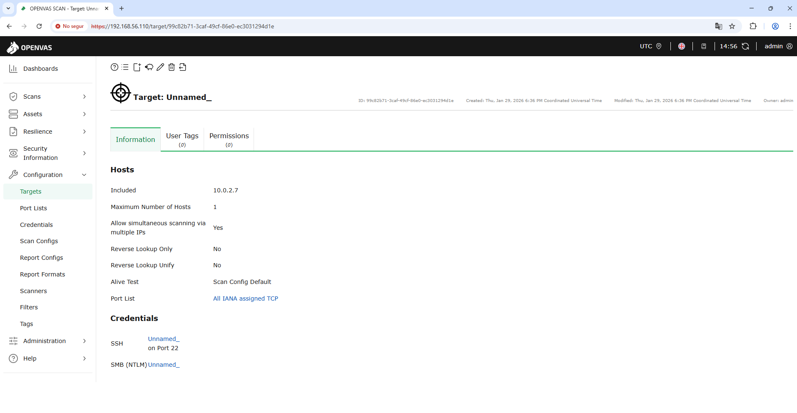

4. Realitza una exploració de vulnerabilitats. Aquest procés pot ser lent, si veieu que us queda poc temps, cancel·leu l’anàlisi i treballeu amb els resultats obtinguts.


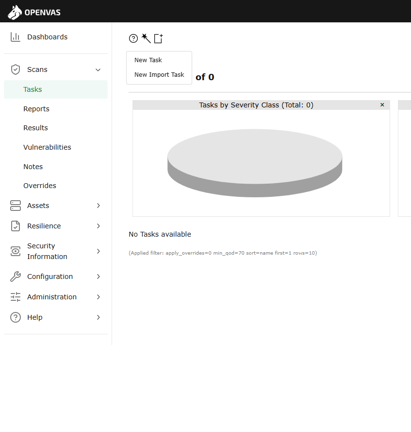

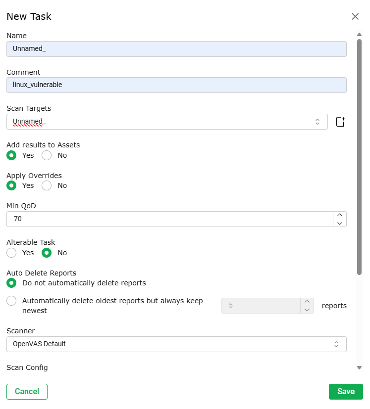

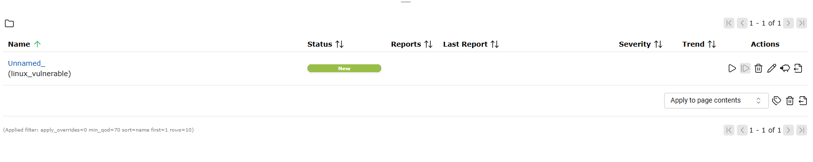

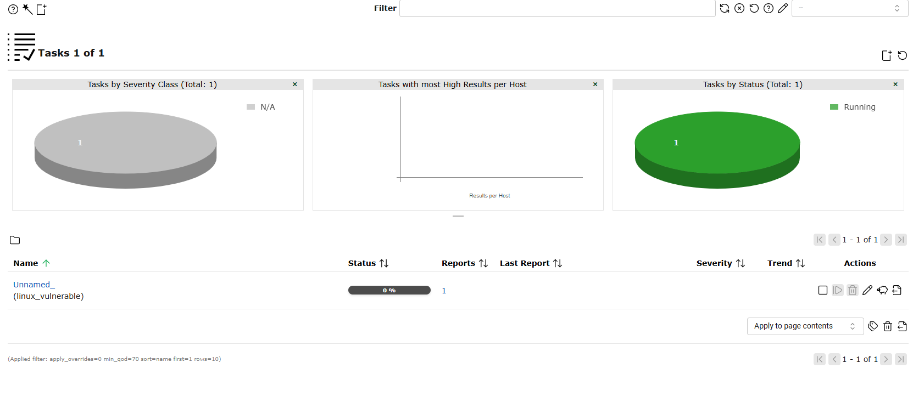

| Recollida de resultats |
|----------------------------------------|

Un cop acabem l’exploració OpenVAS ens mostra els resultats corresponents a la màquina, podem veure la descripció de la vulnerabilitat i resta de informació significativa. 


| Documentació de l'activitat |
|----------------------------------------|

Documenta bé en un arxiu de Google Docs (assegura't de compartir-lo amb el teu professor) o directament en format Markdown, a la carpeta corresponent del repositori GitHub del projecte, els següents punts:

- Documentació del procés d'anàlisi de vulnerabilitats seguit:

-Configuració de la màquina vulnerable.

-Configuració de la màquina OpenVAS.

-Passos seguits per realitzar l'anàlisi.

- Analitza quatre vulnerabilitats trobades:

-Descripció de la vulnerabilitat incloent el seu CVE.

-Nivell de gravetat.

-Possible explotació.

-Mesures de mitigació proposades.


[Anar a l'enunciat](../Tasca09/README.md)  
[Anar a la pàgina inicial](../README.md)
